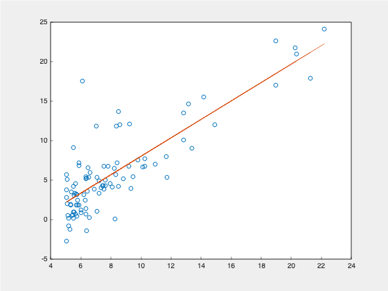

# Linear Regression with Machine Learning v.1
This is my implementation of Linear Regression using Machine learning.
I have included functions for matrix manipulation, computing the minimized cost, and 
optimizing theta (the gradient hypothesis) using gradient descent. 

## Matplot++
NOTE: In order to graph the data set and line of best fit, I have included
the c++ graphics library [Matplot++](https://github.com/alandefreitas/matplotplusplus).
It is required to run the program. I have also included my `CMakeLists.txt` file to the 
program can be compiled with `make`

## Data Sets
I have included to example data sets, they should be in the form:  
    `x,y  
    x,y  
    x,y  `

## Example Output

## One Final Note
This is just the first version of my Linear Regression Function.
Some optimization, error-handling, and polishing is still needed
